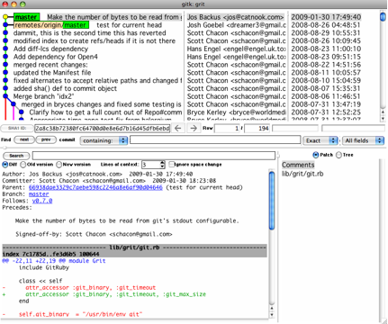

# Getting Started

This chapter will be about getting started with Git.

---

## 1.1 Getting Started - About Version Control

What is version control, and why should you care? Version control is a system that records changes to a file or set of files over time so that you can recall specific versions later. 

* Local Version Control Systems
Many people’s version-control method of choice is to copy files into another directory (perhaps a time-stamped directory, if they’re clever). This approach is very common because it is so simple, but it is also incredibly error prone. It is easy to forget which directory you’re in and accidentally write to the wrong file or copy over files you don’t mean to.￿

* Centralized Version Control Systems

* Distributed Version Control Systems
This is where Distributed Version Control Systems (DVCSs) step in. In a DVCS (such as Git, Mercurial, Bazaar or Darcs), clients don’t just check out the latest snapshot of the files: they fully mirror the repository. 

## 1.3 Getting Started - Git Basics

### Nearly Every Operation Is Local

### Snapshots, Not Differences
![Figure 1-6. Working directory, staging area, and git directory.] (img/three_state.png)

*Committed* means that the data is safely stored in your local database.

*Modified* means that you have changed the file but have not committed it to your database yet.

*Staged* means that you have marked a modified file in its current version to go into your next commit snapshot.

The basic Git workflow goes something like this:

1. You modify files in your working directory.
2. You stage the files, adding snapshots of them to your staging area.
3. You do a commit, which takes the files as they are in the staging area and stores that snapshot permanently to your Git directory.

# Chapter 2 Git Basics

## Initializing a Repository in an Existing Directory
`$ git init`
This creates a new subdirectory named .git that contains all of your necessary repository files — a Git repository skeleton. 

## Cloning an Existing Repository

You clone a repository with git clone `[url]`. For example, if you want to clone the Ruby Git library called Grit, you can do so like this:

`$ git clone git://github.com/schacon/grit.git`

## 2.2 Git Basics - Recording Changes to the Repository

### Removing Files

`$ git rm dosyamiz.txt`

### Moving Files

Unlike many other VCS systems, Git doesn’t explicitly track file movement. 

`$ git mv file_from file_to`

## 2.3 Git Basics - Viewing the Commit History

### Viewing the Commit History

`$ git log`

By default, with no arguments, git log lists the commits made in that repository in reverse chronological order. That is, the most recent commits show up first. 

One of the more helpful options is -p, which shows the diff introduced in each commit. You can also use -2, which limits the output to only the last two entries:

`$ git log -p -2`

For example, if you want to see some abbreviated stats for each commit, you can use the --stat option:

`$ git log --stat`

`$ git log --stat`

As you can see, the --stat option prints below each commit entry a list of modified files, how many files were changed, and how many lines in those files were added and removed. It also puts a summary of the information at the end. Another really useful option is 

 Another really useful option is --pretty. This option changes the log output to formats other than the default. A few prebuilt options are available for you to use. The oneline option prints each commit on a single line, which is useful if you’re looking at a lot of commits. 
 
 In addition, the short, full, and fuller options show the output in roughly the same format but with less or more information, respectively:
 
 
 `$ git log --pretty=oneline`
 
 
 `$ git log --pretty=format:"%h - %an, %ar : %s"`

 `ca82a6d - Scott Chacon, 11 months ago : changed the version number
 085bb3b - Scott Chacon, 11 months ago : removed unnecessary test code
 a11bef0 - Scott Chacon, 11 months ago : first commit
  
  
#### FORMAT OPTIONS
 -------
 Option  Description of Output
 %H  Commit hash
 %h  Abbreviated commit hash
 %T  Tree hash
 %t  Abbreviated tree hash
 %P  Parent hashes
 %p  Abbreviated parent hashes
 %an Author name
 %ae Author e-mail
 %ad Author date (format respects the --date= option)
 %ar Author date, relative
 %cn Committer name
 %ce Committer email
 %cd Committer date
 %cr Committer date, relative
 %s  Subject
 
 
 
 
### Using a GUI to Visualize History

## 2.5 Git Basics - Working with Remotes

## Working with Remotes

To be able to collaborate on any Git project, you need to know how to manage your remote repositories. 

Remote repositories are versions of your project that are hosted on the Internet or network somewhere. 

### Showing Your Remotes

`$ git remote -v`

### Adding Remote Repositories
------------------------------

To add a new remote Git repository as a shortname you can reference easily, run git remote add [shortname] [url]:

